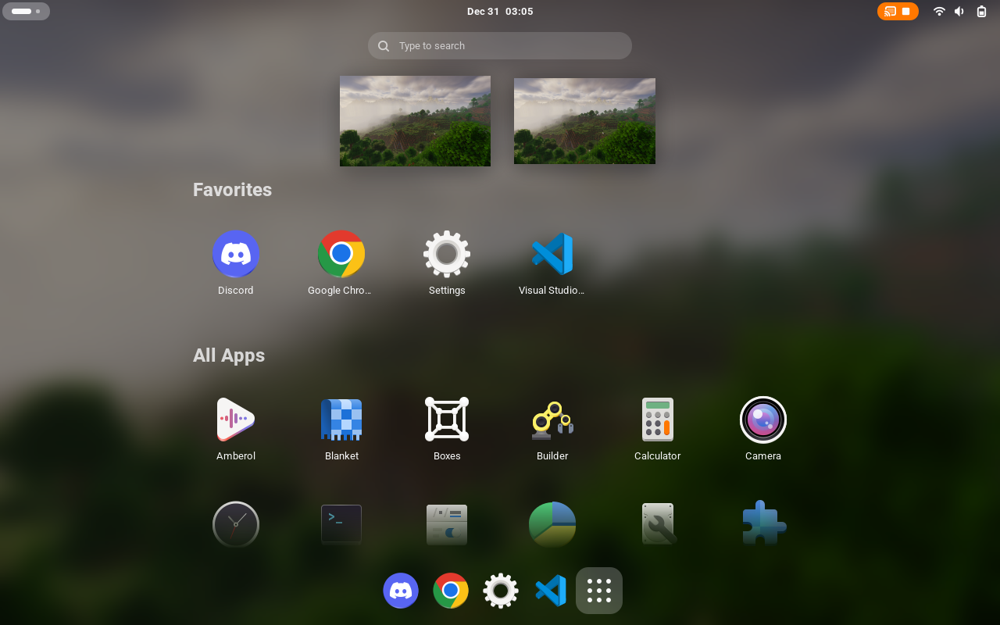

# Vertical App Grid
A GNOME Shell extension that turns the default horizontal app grid into a
vertical one. App icon size and spacing can be customized in the extension
preferences. The implementation is very basic, so drag-and-drop reordering and
app folders are currently not supported.

